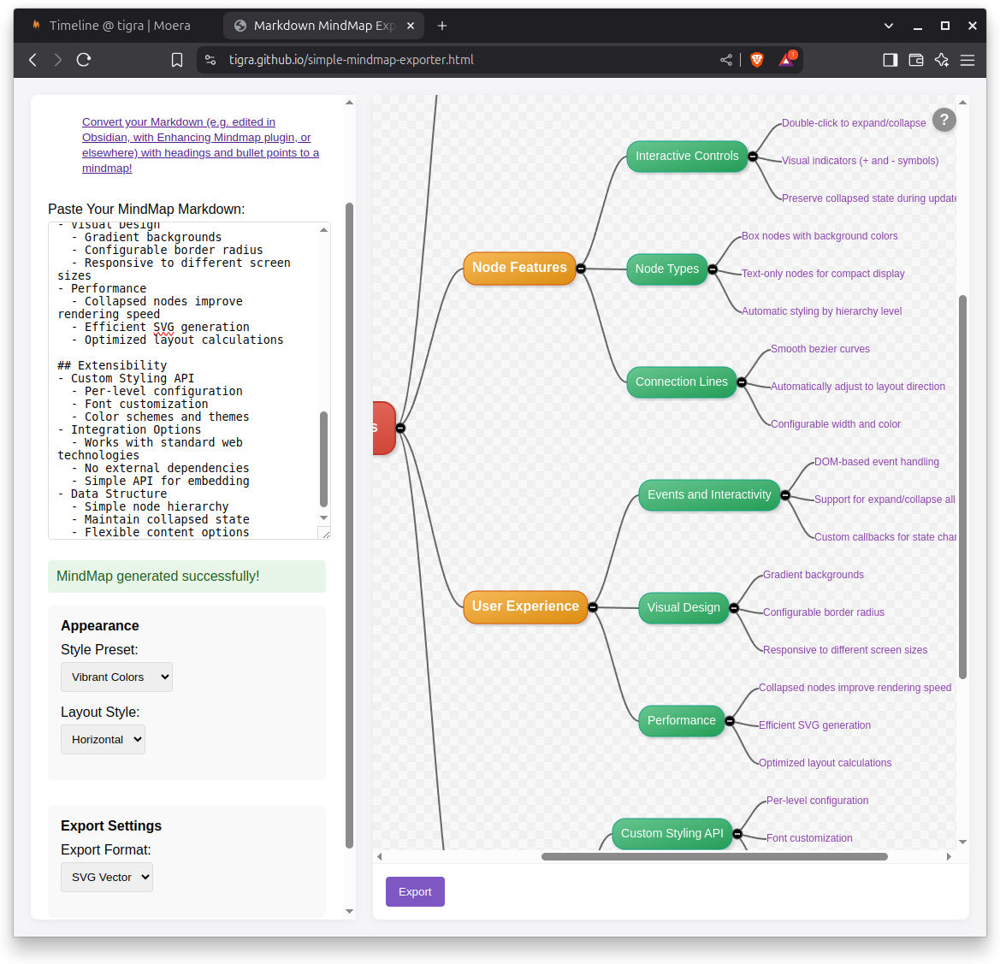

# Simple Markdown to Mindmap converter

[Try it online](https://tigra.github.io/simple-mindmap-exporter.html)

Convert your Markdown (e.g. edited in Obsidian, with Enhancing Mindmap plugin, or elsewhere) with headings and bullet points to a mindmap (.png, .svg).

## HOWTO
1. Open `simple-mindmap-exporter.html` in a browser
2. Copy-paste the contents of `file2.md` (or, just the output from the console)
to the text area. Play with the settings. Click `Generate MindMap`.
3. Then click `Export` to save the result as .png or .svg.

## Navigation Controls
* Scroll: Mouse wheel to scroll vertically or Arrow keys
* Horizontal Scroll: Shift + Mouse wheel or Shift + Arrow keys
* Pan: Middle-click drag or Ctrl + left-click drag
* Zoom in/out: Ctrl + Mouse wheel up/down
* Faster Scroll: Page Up/Down keys
* Jump to Edges: Home/End keys

## How does it look


## Additional tool

Conversion of bullet points to nested headings:

```shell
python transform.py file1.md > file2.md  # transforms nested bullet points to nested headings
```

(not needed anymore because the page supports bullet points itself, but just in case :) 
